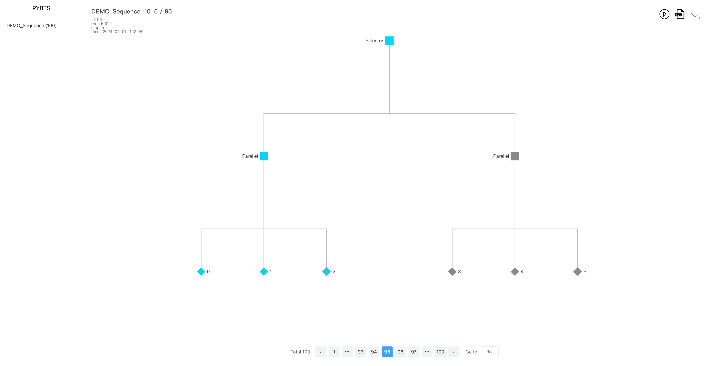
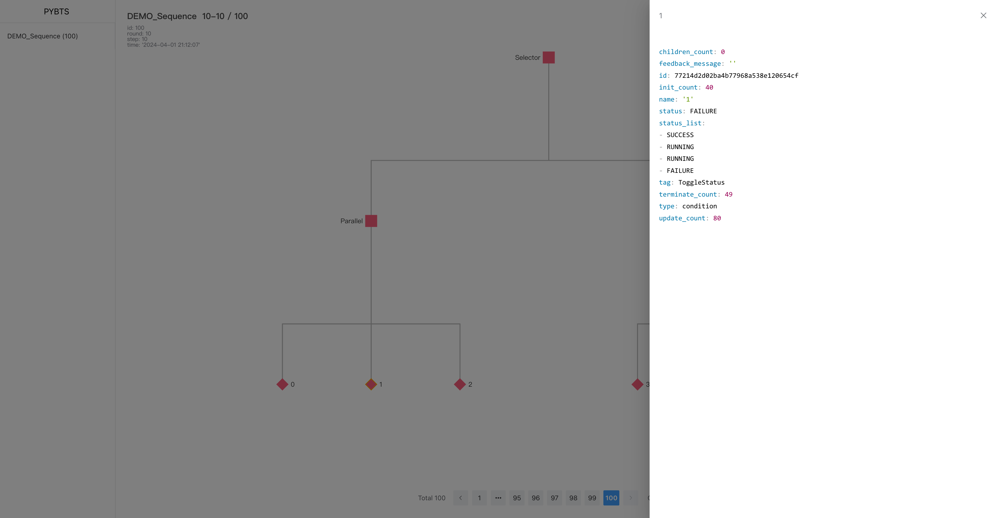

# PYBTS - Python Behavior Tree

[](https://pypi.org/project/pybts/)
[](https://github.com/wangtong2015/pybts)
[](https://pypi.org/project/pybts/)


## Overview

pybts (Python Behavior Tree) is a Python library for creating and managing behavior trees, which are used to model the decision-making process in artificial intelligence systems, such as in games or robotics. The library provides a structured way to organize complex behaviors through a hierarchy of nodes, each representing a specific action, decision, or condition.

## Features

- **Node Hierarchy**: Implements various node types such as `Action`, `Composite`, `Decorator`, and `Condition`, allowing complex behavior modeling.
- **Extensible Framework**: Users can define custom nodes by inheriting from base classes like `Node`, `Composite`, or `Decorator`.
- **Memory Management**: Nodes like `Sequence` and `Selector` can have memory, maintaining state between ticks.
- **Parallel Execution**: Supports parallel node execution with customizable policies (`SuccessOnOne`, `SuccessOnAll`).
- **Behavior Tracking**: Integrates with a `Board` class to track and log the state of the tree during execution.
- **Web Interface**: Features a web server (`BoardServer`) to visualize and manage behavior trees through a web interface, including real-time updates.

## Key Components

- Node Classes: Define the behavior and structure of the behavior tree.
  - `Node`: Base class for all behavior tree nodes.
  - `Composite`, `Decorator`, `Sequence`, `Parallel`, `Selector`: Specialized node types for structuring tree logic.
- Tree Management
  - `Tree`: Represents the entire behavior tree, initialized with a root node.
  - `Board`: Manages logging and tracking of tree state and history.
- Web Server
  - `BoardServer`: Flask-based web server for visualizing and managing behavior trees. Supports dynamic data updates and visualization through ECharts.

## Installation

Currently, pybts is not available through package managers and must be installed by cloning the repository:

```sh
pip install pybts
pip install pybts[rl] # add reinforcement learning support
# or
git clone https://github.com/wangtong2015/pybts.git
cd pybts
pip install -r requirements.txt
pip install .
```

## Usage

1. **Define Behavior Nodes**: Create custom behavior nodes by extending `pybts.Node` or other specific node types like `Action`, `Condition`, etc.
2. **Build the Behavior Tree**: Use the `pybts.builder.Builder` to create trees from your nodes.
3. **Track and Log**: Initialize a `Board` object with your tree to enable tracking and logging.
4. **Visualize and Manage**: Start the `BoardServer` to view and interact with the behavior tree in a web interface.

### Example

```python
from pybts import Tree, board, builder
from pybts.node import Action
from py_trees import common
import time

# Define custom behavior node
class Person(Action):
  def __init__(self, name: str, age: int):
    super().__init__(name=name)
    self.age = age

  def update(self) -> common.Status:
    self.age += 1
    return common.Status.SUCCESS


# Build the behavior tree
builder = builder.Builder()
builder.register('Person', Person.creator)
root = builder.build_from_file('demos/demo_bt.xml')
tree = Tree(root=root, name='Person')

# Initialize board for tracking
bt_board = board.Board(tree=tree, log_dir='logs')

bt_board.clear()
for i in range(10000):
  tree.tick()
  bt_board.track(info={
    'test_info': i
  })  # track the tree status
  time.sleep(0.5)
```

## Web Interface

**Running the Board Server:**

Use the following command to start the `BoardServer` with the specified log directory, enabling debug mode, and setting the host and port:

```
python -m pybts.board_server --dir=logs --debug --host=localhost --port=10000
```

1. This command starts the pybts board server using the `logs` directory for storing and retrieving behavior tree logs. Debug mode is enabled, and the server is accessible at `http://localhost:10000`.
2. **Alternative Command:** If you have a command line interface setup for `pybts` as a package, you can also start the server using a more direct command:

```bash
pybts --dir=logs --debug --host=localhost --port=10000
```

1. This assumes that `pybts` is configured as a command-line tool that internally calls `pybts.board_server`.

After running the appropriate command, you can open a web browser and navigate to `http://localhost:10000` to view and interact with the behavior tree visualizations and management tools provided by pybts.








## Acknowledgements

This project, PYBTS (Python Behavior Tree), is developed based on the `py_trees` library, a powerful and flexible Python framework for building and managing behavior trees. We extend our heartfelt thanks to the `py_trees` project and its contributors for providing the foundational components and concepts upon which pybts is built.

For more information about `py_trees` and to access its source code, visit the official GitHub repository: [py_trees on GitHub](https://github.com/splintered-reality/py_trees).

We appreciate the effort and expertise that has gone into `py_trees`, making it possible for us to develop advanced features in pybts and offer a comprehensive behavior tree solution in the Python ecosystem.

## Development and Contributions

Contributions to pybts are welcome! You can contribute by submitting issues, providing updates to documentation, or submitting pull requests with new features or bug fixes.
